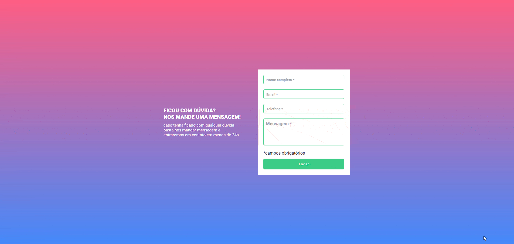

# Quest JS Intermediário - DEVQUEST


#### Este é um modelo de formulário desenvolvido a partir do curso DevQuest

## Índice

- [Capturas de telas](#capturas-de-telas)
- [Links](#links)
- [Construído com](#construído-com)
- [O que aprendi](#o-que-aprendi)
- [Desenvolvimento contínuo](#desenvolvimento-contínuo)
- [Recursos úteis](#recursos-úteis)
- [Luis Fernando Guimaraes](#autor)

### Capturas de telas

#### Tela Desktop



### Links

- Site URL: https://luis92guimaraes.github.io/Quest-Js-Intermediario-DevQuest/

### Construído com

<div style="display: inline_block"><br>
  
  
        
</div>

### O que aprendi

Esse exercicio é proposto dentro do curso DEVQUEST. Foi proposto como desáfio de nível intermediário dos estudos de JavaScript. Estou desenvolvendo meus estudos com o uso do JavaScript e venho gostando da minha evolução!

## Trechos de códigos

```
const inputs = document.querySelectorAll('.campo');
const botao = document.getElementById('enviar');
botao.addEventListener('click', (evento) =>{
    evento.preventDefault()
    inputs.forEach(input => {
        console.log(input.value)
        if (input.value === "") {
            input.classList.add('vazio')
            input.nextElementSibling.classList.add('mostrar')
        } else {
            input.classList.add('preenchido')
            input.classList.remove('vazio')
            input.nextElementSibling.classList.remove('mostrar')
        }
    })
})
```

### Desenvolvimento contínuo

Pretendo continuar aprendendo cada vez mais sobre as ferramentas utilizadas nesse projeto, ainda tem muita coisa pra ser absorvida mas sigo confiante e feliz em estar conseguindo tornar meu conhecimento solido e poder realizar projetos como esse com mais clareza e confiança a cada dia de estudos.

### Recursos úteis

- [Mdn](https://developer.mozilla.org/en-US/) - O Mozilla Developer Network (MDN) desempenha um papel crucial ao fornecer recursos abrangentes e atualizados para desenvolvedores web em todo o mundo.
- [W3School](https://www.w3schools.com/css/default.asp) - Esse site sempre me ajuda a resolver qualquer problema relacionados a códigos de uma maneira fácil e muito rápida.
- [Dev em Dobro](https://www.youtube.com/@DevemDobro) - Este é um canal onde encontro muito material. Tem muito conteúdo relacionado ao desenvolvimento. Recomendo a todos que querem aprender sobre esse e outros conceitos relacionados.

## Autor

[Luis Fernando Guimarães](https://www.linkedin.com/in/luisfguimaraes/)
